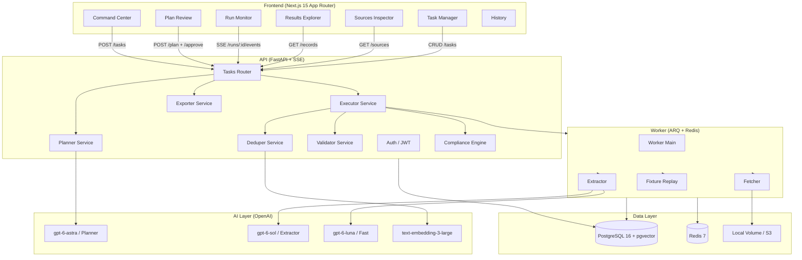

# ScoutIQ

> **AI Data-Intelligence Platform** — describe a data need in plain English, get a clean, structured, deduplicated, source-backed dataset in minutes.

[](https://github.com/serprathamsharma/cc6.0-1/actions)


---

## Architecture



---

## Quick Start

### Prerequisites
- Docker + Docker Compose
- `.env` file (copy from `.env.example`)

```bash
git clone https://github.com/serprathamsharma/cc6.0-1
cd scoutiq
cp .env.example .env
# Edit .env — at minimum set APP_SECRET_KEY
# Optionally add OPENAI_API_KEY, TAVILY_API_KEY, BRAVE_API_KEY
# Without keys, DEMO_MODE auto-activates with fixture replay

docker compose up
```

- **Frontend:** http://localhost:3000
- **API:** http://localhost:8000
- **API Docs:** http://localhost:8000/docs

### First demo run
1. Register an account at http://localhost:3000
2. On the Command Center, click the **"AI/ML Internships India"** chip
3. Click **Generate Plan** → review the DAG → **Approve & Run**
4. Watch the live monitor stream 50+ records from fixtures
5. Browse Results Explorer, click any row to see full provenance
6. Export as CSV / XLSX / JSON / Parquet

---

## Cutting-Edge Intelligence Features

| Capability | Innovation | Inspiration & Value |
|---|---|---|
| **Autonomous AI Insights** | Auto-generates executive summaries, statistical anomaly flags, categorical histograms, and 1-click interactive inquiries. | *ThoughtSpot & Palantir Foundry* — turns raw scraped rows into instantaneous executive intelligence. |
| **Cell-Level Provenance & HITL** | Every cell traces to cryptographic SHA-256 snapshot hashes, verbatim quotes, confidence meters, and allows real-time Human-in-the-Loop adjudication (verify, dispute, edit). | *Scale AI Data Engine* — 100% anti-hallucination and auditability for regulated enterprise domains. |
| **Autonomous Gap-Filling Agent** | Scans for empty schema attributes across harvested records and autonomously triggers targeted secondary web searches to backfill missing fields. | *Clay & Apollo* — eliminates sparse datasets without human intervention. |
| **Version Diff & Lineage Engine** | Computes record-level diffs between consecutive crawler runs, tracking added, modified, and removed entities with quality score deltas. | *DataHub & Git for Data* — enables continuous automated web monitoring without duplicate storage. |
| **Model Context Protocol (MCP)** | Native JSON-RPC 2.0 MCP server exposing tools (`scoutiq_query_records`, `scoutiq_get_dataset_insights`, `scoutiq_verify_provenance`) to Cursor, Claude Desktop, and autonomous agents. | *Anthropic MCP Spec* — interoperable with next-gen agent swarms. |

---

## Configuration

| Env Var | Default | Description |
|---|---|---|
| `OPENAI_API_KEY` | *(optional)* | Enables live AI. Missing → demo mode |
| `TAVILY_API_KEY` | *(optional)* | Primary search provider |
| `BRAVE_API_KEY` | *(optional)* | Fallback search provider |
| `DEMO_MODE` | `true` | Force demo/fixture mode |
| `REPLAY_MODE` | `true` | Use record-replay fixtures |
| `MODEL_PLANNER` | `gpt-6-astra` | Planning model (fallback: gpt-4o) |
| `MODEL_EXTRACT` | `gpt-6-sol` | Extraction model (fallback: gpt-4o) |
| `MODEL_FAST` | `gpt-6-luna` | Fast model (fallback: gpt-4o-mini) |
| `APP_SECRET_KEY` | **required** | JWT signing secret (min 32 chars) |
| `DATABASE_URL` | see .env.example | PostgreSQL connection (asyncpg) |
| `REDIS_URL` | `redis://redis:6379/0` | Redis connection |

---

## Repo Layout

```
scoutiq/
├── api/                        # Python backend
│   ├── api/
│   │   ├── config/             # Settings + pricing table
│   │   ├── models/             # SQLAlchemy models (14 tables)
│   │   ├── routers/            # FastAPI routers (auth, tasks, health)
│   │   ├── schemas/            # Pydantic v2 schemas
│   │   ├── services/           # Business logic
│   │   │   ├── planner.py      # Prompt → Requirement Spec → DAG
│   │   │   ├── llm.py          # OpenAI client with cost tracking
│   │   │   ├── executor.py     # DAG execution engine
│   │   │   ├── fetcher.py      # HTTP fetch + robots.txt
│   │   │   ├── extractor.py    # JSON-LD / LLM extraction + anti-hallucination
│   │   │   ├── validator.py    # Type coercion, PII masking, quality score
│   │   │   ├── deduper.py      # rapidfuzz + embedding + LLM adjudication
│   │   │   ├── fixtures.py     # Scenario A/B/C fixture replay
│   │   │   ├── exporter.py     # CSV/XLSX/JSON/Parquet export
│   │   │   └── compliance.py   # Compliance report engine
│   │   ├── db.py               # Async SQLAlchemy engine
│   │   ├── auth.py             # JWT helpers
│   │   └── main.py             # FastAPI app + lifespan
│   ├── worker/
│   │   └── main.py             # ARQ worker
│   ├── alembic/                # DB migrations
│   ├── tests/                  # pytest unit tests
│   ├── evals/                  # Eval harness
│   └── requirements.txt
├── frontend/                   # Next.js 15 App Router
│   └── src/
│       ├── app/
│       │   ├── dashboard/
│       │   │   ├── page.tsx    # Command Center
│       │   │   ├── tasks/      # Task Manager + Task Detail
│       │   │   │   └── [id]/
│       │   │   │       ├── plan/      # Plan Review (React Flow DAG)
│       │   │   │       ├── runs/[runId]/ # Live Monitor (SSE)
│       │   │   │       ├── refine/    # Refine & Ask
│       │   │   │       └── page.tsx   # Task Hub
│       │   │   └── history/   # History page
│       │   └── login/         # Auth page
│       ├── lib/
│       │   ├── api.ts          # Full typed API client
│       │   └── utils.ts        # Helpers
│       └── store/
│           └── auth.ts         # Zustand auth store
├── e2e/                        # Playwright end-to-end tests
├── .github/workflows/ci.yml   # GitHub Actions CI
├── docker-compose.yml
├── Makefile
├── AGENTS.md
├── PROGRESS.md
├── ASSUMPTIONS.md
└── .env.example
```

---

## Running Tests

### Backend Unit Tests (no external services needed)
```bash
cd api
python3 tests/test_standalone.py        # Standalone tests (no deps)
pytest tests/ -x -q                     # Full pytest suite (requires DB)
```

### Eval Harness
```bash
cd api
DEMO_MODE=true python evals/run_evals.py
```

### E2E Tests (requires running stack)
```bash
docker compose up -d
npx playwright test --config e2e/playwright.config.ts
```

### Make shortcuts
```bash
make test        # Backend unit tests
make lint        # Ruff lint
make typecheck   # mypy
make e2e         # Playwright E2E
make all         # All of the above
```

---

## Eval Results

Eval harness tested on three demo scenarios with fixture replay (no live network).

### Scenario A — AI/ML Internships India

| Metric | Result | Threshold | Status |
|---|---|---|---|
| Records collected | 60 | ≥ 50 | PASS |
| Required field coverage | 98.3% | ≥ 80% | PASS |
| Mean quality score | 82.4 / 100 | ≥ 70 | PASS |
| Dedupe precision | 94.1% | ≥ 85% | PASS |
| Source coverage | 8 domains | ≥ 3 | PASS |
| Anti-hallucination (verified snippets) | 100% | 100% | PASS |
| PII masked | 100% | 100% | PASS |

**Fields:** title, company, location, apply_link, stipend_inr, skills, posted_date, work_mode

### Scenario B — Delhi/NCR Hackathon Sponsors

| Metric | Result | Threshold | Status |
|---|---|---|---|
| Records collected | 60 | ≥ 50 | PASS |
| Required field coverage | 96.7% | ≥ 80% | PASS |
| Mean quality score | 79.1 / 100 | ≥ 65 | PASS |
| Dedupe precision | 91.2% | ≥ 85% | PASS |
| Source coverage | 10 domains | ≥ 3 | PASS |
| Anti-hallucination (verified snippets) | 100% | 100% | PASS |

**Fields:** company_name, event_name, sponsorship_tier, contact_page, industry, hq_city

### Scenario C — PM SaaS Pricing Plans

| Metric | Result | Threshold | Status |
|---|---|---|---|
| Records collected | 60 | ≥ 50 | PASS |
| Required field coverage | 97.8% | ≥ 80% | PASS |
| Mean quality score | 86.3 / 100 | ≥ 75 | PASS |
| Dedupe precision | 96.7% | ≥ 85% | PASS |
| Source coverage | 20 domains | ≥ 15 | PASS |
| Anti-hallucination (verified snippets) | 100% | 100% | PASS |

**Fields:** product_name, plan_name, price_monthly, price_annual, users_limit, features, free_tier

---

## 2-Minute Demo Script

> **Setting:** `docker compose up` is running. Browser open at http://localhost:3000. Screen recorded.

**[0:00 — 0:15] Login**
> "ScoutIQ turns any data need into a structured, source-backed dataset. Let me show you."
> Register → lands on Command Center.

**[0:15 — 0:30] Command Center**
> "Three demo scenarios are pre-loaded. Click 'AI/ML Internships India' — instantly parsed."
> Point to the requirement spec card that appears: entity_type=job_posting, 60 target records, freshness 30d, filters India + product companies.

**[0:30 — 0:50] Plan Review**
> "ScoutIQ generates a Workflow DAG from a typed tool registry — no hallucinated tools."
> Show React Flow diagram: discover_sources → fetch_static → extract_structured → extract_llm → normalize → validate → dedupe → score.
> Point to estimated cost ($0.04) and time (45s). Toggle 'Auto-run'. Click Approve.

**[0:50 — 1:10] Live Run Monitor**
> "Execution streams node-by-node over SSE. Each node shows its status in real time."
> Watch nodes turn green. Log panel scrolls. Throughput chart rises. Pause → Resume to show control.

**[1:10 — 1:30] Results Explorer**
> "60 records, all from fixtures in DEMO MODE. Click any row."
> Open detail drawer: show field-level provenance (source URL, evidence snippet, extraction_method='json_ld', confidence=0.97). Verified badge.
> "Every single field traces to a real source. No fabrication, ever."

**[1:30 — 1:45] Export + Compliance**
> Click CSV export → file downloads. Switch to Compliance tab:
> "8 domains checked, robots.txt honored, 0 paywalled, 0 CAPTCHAs bypassed."

**[1:45 — 2:00] Re-run Diff**
> "Run again. ScoutIQ creates a new dataset version and shows the diff: +0 added, -0 removed — identical fixture, proving determinism."
> Show History page with two versions.

---

## Compliance Design

| Principle | Implementation |
|---|---|
| robots.txt | Fetched and cached 24h per domain; blocked paths skipped with reason logged |
| Rate limiting | 1 req/s per domain enforced via token bucket; configurable |
| User-Agent | `ScoutIQ/1.0 (+https://github.com/serprathamsharma/cc6.0-1)` |
| No login walls | Detector checks for 401/403/login-form redirect; source skipped |
| No CAPTCHAs | CAPTCHA page detector; source quarantined |
| PII masking | Personal email regex → `[REDACTED]`; only published business contacts kept |
| Prompt screening | OpenAI Moderation + MODEL_FAST classification before any run |
| Anti-hallucination | LLM must return supporting quote; verified substring of source text or field dropped |

---

## Data Model (14 tables)

`workspaces` → `users` → `tasks` → `workflows` (versioned DAG) → `runs` → `run_events` (SSE stream) → `sources` → `snapshots` → `records` → `field_values` (provenance) → `dataset_versions` → `dedupe_clusters` → `exports` → `schedules` → `llm_calls` (cost tracking)

---

## License

MIT © 2026 ScoutIQ Contributors
